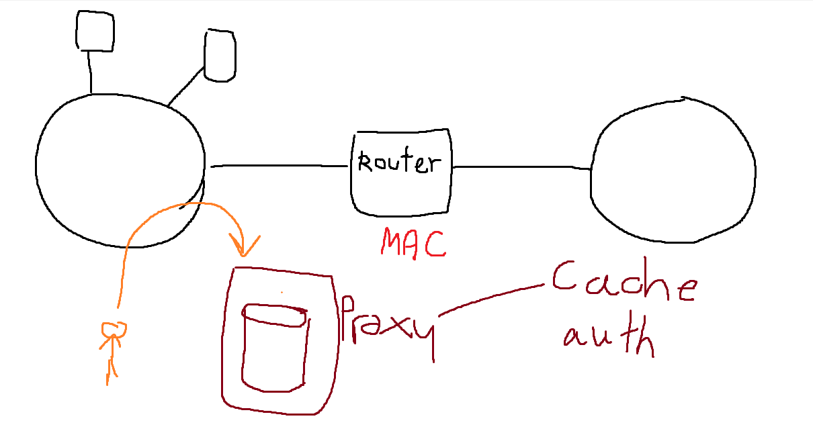

# Assignment 3 : Proxy Server
## Proxy : Protect การใช้ Internet 

### Router 
- MAC address

### Proxy Server

- cache and authen are used.
- Authenticate - user have to pass proxy first to go to the internet so you can verify certain user can use internet or block(url or ip only can be block)
- Squid : Application proxy 

### Enviroment
- Linux (Proxy Server): add another card LAN (1 : NAT or Bridge (Public Access) , 2:Host Only(Private Access))
- Window (Client): Host Only LAN  --> make sure window can't use internet

### Instruction
1. SetUP the Squid Proxy (at port 3218) (Window Proxy: 8080)
2. squid.conf : default squid --> All Block --> 1) ACL(Access Control List) : allow Your private IP Class
3. verify that window can use internet
4. squid have log in cache (Capture log file: search your browse web to verify)
5. 2) add squid user --> start server --> if correct --> Ask User Password --> if fill user passwd correct --> can access Internet
6. 3) Block url www.engr.tu.ac.th --> can't access engr website

## Security : Secure System
### TCP wrapper
- /etc/host.allow
- /etc/host.deny
- filter 6 services which are Telnet(telnetd), FTP(ftpd), Finger, Talk, rlogin, SSH(ssh) --> usually block remote login
- sshd:192. --> All IP 192.x.x.x 
- sshd:ALL --> All IP
- allow --> sshd:192.168.210. , deny --> sshd:ALL 
- Firewall(ปิดทุกอย่าง เปิดบางอย่าง)