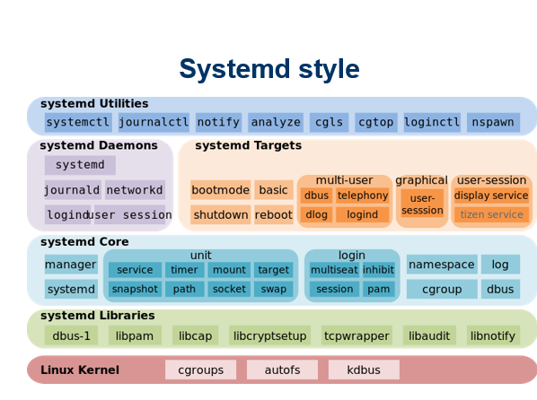
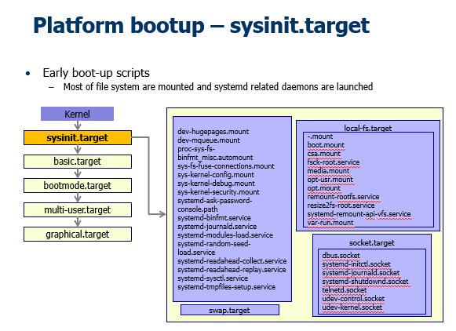
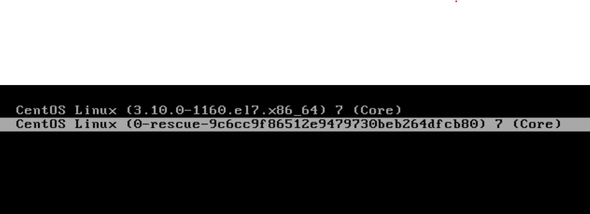
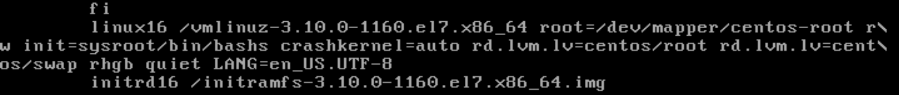

# Understanding System Initialization

## Hardware Initialization
- BIOS : cheack every element in pc

## Boot Loader
- at hdd 
- boot manager 
- use for booting dirrent version or os

## **Linux 7 Level (init)**
- 7 Level Contains called ***init***
  - 0 : HALT -->shutdown
  - 1 : Single Mode/ Rescue Mode : use for maintainance --> mostly use in repairing hdd, admin forgeting password --> Reset Password
  - 2 : No Net/ No GUI (Old : use 3 instead)
  - 3 : Network without GUI Mode 
  - 4 : No Use
  - 5 : Network with GUI Mode
  - 6 : Reboot Mode
  
- Power On --> 5 (default) or 3 --> use power off --> 0 (which program should be terminate)
- Each level contain sequence of program to start and terminate.
- called ***run level***
- manage directory is @ /etc/rc.
  - contain **init.d(direatory) rc.local** ver.9
  - contain many rc#number e.g. rc3 : run in level 3 --> (Stop) K50networ, S10Network(Start) : when go to level 3 run S10Network file smallest number runs first.
- start or stop service manualy
  - servive command
    - service named start
    - service named status
    - service lpd restart

## **Systemd**
- Use OO

- called ***target***

- change naming : e.g. level 5 --> multi-user
- target
  - sysinit.target
  - basic.target
  - bootmode.target
  - multi-user.target
  - graphical.target

### Systemctl
- To start or stop a service 
  - systemctl ***start*** blah.service
  - systemctl ***stop*** blah.service
- Restart(stop and start) and reload(reconfig)
  - systemctl ***restart*** blah.service
  - systemctl ***reload*** blah.service
- Enabling(start everytime when booted) or disabling units 
  - systemctl ***enable*** blah.service
  - systemctl ***disable*** blah.service
- systemctl list-units --all
- systemctl list-unit-files : to see all the units and if they are enabled or not

### Logging 
- journalctl –k

### Systemd Targets
- Setting a default target 
  - systemctl set-default graphical.target
- Getting the current default 
  - systemctl get-default
- And for compatibility, there are symlinks to
  - runlevel0.target -> poweroff.target
  - runlevel1.target -> rescue.target
  - runlevel2.target -> multi-user.target
  - runlevel3.target -> multi-user.target
  - runlevel4.target -> multi-user.target
  - runlevel5.target -> graphical.target
  - runlevel6.target -> reboot.target

## **Single User Mode**

-require password --> Edit

- replace ro with rw init=/sysroot/bin/bash
- boot without using disk and then using chroot to mount disk
- delete password for root
- Replace ro with rw init=/sysroot/bin/bash
- Press ctrl+x to boot
- Type “chroot /sysroot/
- vi /etc/shadow
- Alt+Ctrl+Del to restart

## Shutting Down
- Use reboot command
- Use halt command
- Use shutdown command
- Pressing Ctrl+Alt+Del (Restart)
- Entering the command init 0 
  - Halt system
- Entering command init 6
  - Restart system
## Systemctl
- Power off the system 
  - systemctl poweroff
- reboot the system
  - systemctl reboot
- boot into rescue mode
  - systemctl rescue
