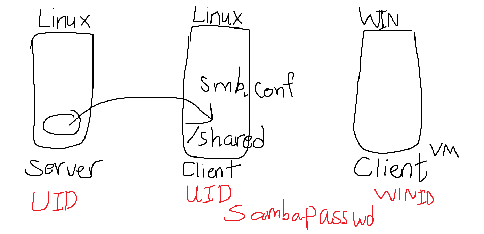
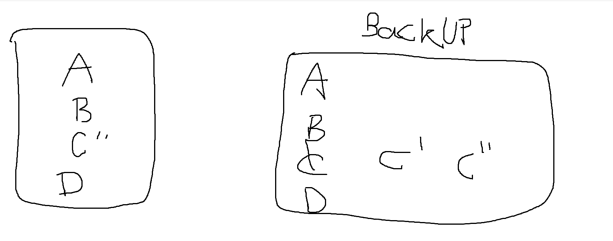

## Window Only have  CIFS or SMB(Samba) Protocol
## Window Client using samba
# Samba
## ที่มา
- MS DOS : IMB CC DOS --> Mainframe  จึงสร้าง SMB
## Overview
- can be attacked by ransomware
- used the Server Message Block(SMB) protocol 
- is native to Windows, unlike NFS
- CIFS
## Servive
- Linux use IP to communicate
- Window use name to communicated(WINS:window protocol)
- allow browsing network.
## WorkGroup & Domain
- ทั้งสองอันไว้ใช้ grouping client
- Domain มีคุณสมบัติการทำ single signON --> เข้าเครื่อง a เข้าเครื่อง b ได้เลย หากอยู่ใน domain เดียวกัน
- WorkGroup is single authenticated
## Installation
- yum install smb
- /etc/samba/smb.conf --> set the config
- start server
## Samba Password
- Window ID != Linux/Samba ID
- use for authen linux and window 
## Permission
### สิทธิ file system กับ สิทธิ Shared ไม่เหมือนกัน
- file system ใหญ่กว่า --> A.txt 644 shared 777 --> User ทั่วไป เขียนไม่ได้
- A.txt 777 shared 644 --> User ทั่วไป เขียนไม่ได้
### Case Sensitive
## smbpasswd -a ninja
- add user password สัมพันธ์กับ window 

# Assigment 2 : NFS and Samba
- Samb and User ID
## UID
- 1 Server 2 Client
- server is NFS server 
- add 2 users at Linux server --> shared home directory --> in client mount on directiry 
- add user 2 in linux client --> home is at shared folder
- check the linux client login user 2 : read file write file
- ห้ามใช้ 777

## Samba 
- install samba
- add shared folder in smb.conf
- explain parameter 
- add first and second user at linux client
- recommend window7 VM 
- window: mapping drive 
- login user1,2 on window 
- user 1, 2 can read write if not explain and fix
- 777 are not allowed
  

  
# Linux Administrator
## Basic BackUp Concept

- full backup : same size as original, take time
- ควรทำ วันศุกร์เที่ยงคืน เสร็จวันอาทิตย์ --> มีการใช้ disk น้อย
- mon : edit file A C --> เก็บ A' C' --> เก็บเฉพาะสิ่งเปลี่ยนแปลง Incremental BackUP
- Tue : A'' B' C''--> Incremental BackUp
- Wed, Thr, Fri --> Incremental BackUP
- Incremental BackUP ขึ้นกับ แต่ละบริษัท --> Bank every 2 hours.(12 Times a day)
## Restore
- ดึงมาจาก Full BackUp --> Incremental ทีละอัน: F-->I1-->I2-->I3 : **Slow**

## BackUP Continue
- Diffrence Backup : Check from full backup --> store A''
- D can make recovery faster.
- I6-I10 : เทียบกับ D

## Why BackUP?
- เผลอลบไฟล์
- hardisk เสีย
- อยากได้ version เก่า
- migration failure --> Upgrade or change system

## How to BackUP
- Past: Using Tape
- จารไม่ได้เน้น แค่ให้ดู

## Scheduling 
### at
- #at จะทำ 1 ครั้ง
- #at [-f file] TIME
- #at 12:50
- -->return prompt
- at>ls -l
- at>whoami
- ctrl+D
- mail

### crontab
- 5 Parameter --> Min Hr Day Month DayOfWeek
- 0 8 * * * ls -la --> all day all month at 8:00 done ls -la
- 30 2 * 1 0,6 --> ตี 2 30 นาที ทุกเสาร์ อาทิตย์ เดือนมกรา
- 30 2 3 1 0 --> ON sunday 3 January at 2:30 am
- 0 0,12 * * * --> Noon and Midnight 
- 0,10,20,30,40,50 * * * * -->every 10 min
- crontab -e --> go to vi editor
- crontab -l : list
- crontab is on user

