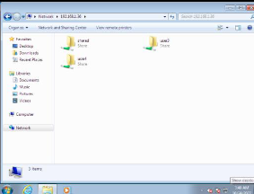
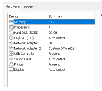
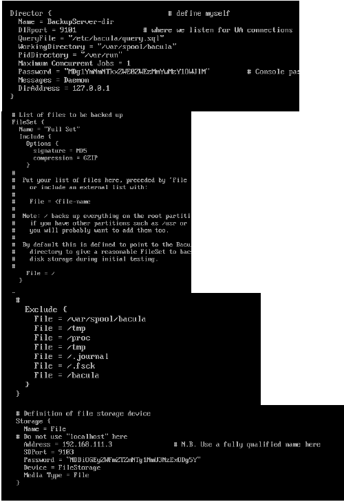

# Assignment 1
## Requirement
- 2 Linux : Server and Client
  
## 1. Manual Mount
- Both Server and Client
```
yum install nfs-utils libnfsidmap
```

### Server 
- Enable and Start Service
```
systemctl enable rpcbind
systemctl enable nfs-server
systemctl start rpcbind
systemctl start rpc-statd
systemctl start nfs-server
```
- Add Services and Ports For the firewall
```
firewall-cmd --permanent --add-service=rpc-bind
firewall-cmd --permanent --add-service=mountd
firewall-cmd --permanent --add-port=2049/tcp
firewall-cmd --permanent --add-port=2049/udp
firewall-cmd –reload
```
- สร้าง shared directoryและเปลี่ยน chmod ให้เป็น 777
```
mkdir /shared
chmod 777 /shared
vi /etc/exports
```

```
exportfs -r
showmount -e localhost
```

### Client
- Enable and Start Service
```
systemctl enable rpcbind
systemctl start rpcbind
```
- เช็คว่าทําการ mount แล้วหรือยังและทําการ mount folder /shared
```
  showmount -e 192.168.1.35
  mount -t nfs 192.168.1.35:/shared /shared
  df -kh (เช็คว่าทําการ mount แล้วหรือยัง)
  ```

## 2. Auto Mount when reboot

### Client
```
vi /etc/fstab
```


```
umount /test1/
mount -av
```


## 3. Autofs
### Client
```
yum install -y autofs
vi /etc/auto.master 
```


```
vi /etc/auto.misc
```

```
systemctl enable autofs
systemctl start autofs
```


# Assignment 2
## Requirement
- 2 Linux [Server and Client] and 1 Window Client

## Mount Directory In /etc/fstab

- Then Change home directory to directory where is mounted


## Window Client
```
yum install samba
vi /etc/samba/smb.conf
```

- Parameter :
  1. path -> path of directory
  2. valid users = user2,user3 -> allowed user to this directory
  3. public ->make the directory visible
  4. writable -> make user write or create file


- Add Samba User

```
smbpasswd -a user2
smbpassed -a user3
```


```
firewall-cmd --permanent --add-port=139/tcp
firewall-cmd --permanent --add-port=445/tcp
firewall-cmd --permanent --add-port=137/udp
firewall-cmd --permanent --add-port=138/udp
firewall-cmd --permanent --add-port=139/udp
firewall-cmd --reload
systemctl restart smb
```

# Assignment 3

## Requirement
- 1 linux server and 1 Window Client
- SetUp Linux interface


- SetUp Window interface


```
Yum install squid
Systemctl start squid
Systemctl enable squid
Systemctl status squid
```
- Config the squid.conf and setup the proxy in client
  


## Set proxy password
```
yum install -y httpd-tools
```


## Block Sites


# Assignment 4
## Requirement
- 3 linux
  1. DNS Server
  2. Apache Server
  3. Syslog Server

## DNS Server
```
yum install -y httpd
vi /etc/named.conf
```


- Edit these files
```
vi /var/named/ece.forward.zone
vi /var/named/ece.reverse.zone
```


## Apache Server

- Make vhost.conf file 


## Syslog Server
```
yum install -y rsyslog
firewall-cmd --permanent --zone=public --add-port=514/tcp
firewall-cmd --permanent --zone=public --add-port=514/udp
firewall-cmd –reload
vi /etc/rsyslog.conf
```
```
# Provides UDP syslog reception
$ModLoad imudp$UDPServerRun 514
# Provides TCP syslog reception
$ModLoad imtcp
$InputTCPServerRun 514
```

```
systemctl start rsyslog
cat/var/log/messages
```

### On DNS and Apache Server
```
vi /etc/rsyslog.conf
```


# Assignment 5

## Requiremnt 
- 2 Linux servers : Bacula Server and Client

## On Bacula Server
```
sudo yum install -y bacula-director bacula-storage bacula-console bacula-client mariadb-server
sudo systemctl start mariadb
```
- Set the mariaDB to supported Bacula backup scheme.


- Edit the bacula-dir.conf for configuration Director, FileSet, Client, Storage, Catalog and Pool.
```
sudo mkdir -p /bacula/backup /bacula/restore
sudo chown -R bacula:bacula /bacula
sudo chmod -R 700 /bacula
sudo mkdir /etc/bacula/conf.d
vi /etc/bacula/bacula-dir.conf
```


```
bacula-dir -tc /etc/bacula/bacula-dir.conf
```

- Edit bconsole.conf


```
bacula-sd -tc /etc/bacula/bacula-sd.conf
```

```
DIR_PASSWORD=`date +%s | sha256sum | base64 | head -c 33`
sudo sed -i "s/@@DIR_PASSWORD@@/${DIR_PASSWORD}/" /etc/bacula/bacula-dir.conf
sudo sed -i "s/@@DIR_PASSWORD@@/${DIR_PASSWORD}/" /etc/bacula/bconsole.conf
SD_PASSWORD=`date +%s | sha256sum | base64 | head -c 33`
sudo sed -i "s/@@SD_PASSWORD@@/${SD_PASSWORD}/" /etc/bacula/bacula-sd.conf
sudo sed -i "s/@@SD_PASSWORD@@/${SD_PASSWORD}/" /etc/bacula/bacula-dir.conf
FD_PASSWORD=`date +%s | sha256sum | base64 | head -c 33`
sudo sed -i "s/@@FD_PASSWORD@@/${FD_PASSWORD}/" /etc/bacula/bacula-dir.conf
sudo sed -i "s/@@FD_PASSWORD@@/${FD_PASSWORD}/" /etc/bacula/bacula-fd.conf
```
- Start and Enable bacula-dir service.
```
sudo systemctl start bacula-dir
sudo systemctl start bacula-sd
sudo systemctl start bacula-fd
sudo systemctl enable bacula-dir
sudo systemctl enable bacula-sd
sudo systemctl enable bacula-fd
```

```
sudo mkdir /etc/bacula/conf.d
sudo vi /etc/bacula/bacula-dir.conf
```
- At the end of the file add
```
@|"find /etc/bacula/conf.d -name '*.conf' -type f -exec echo @{} \;"
```
```
sudo vi /etc/bacula/conf.d/pools.conf
```
```
Pool {
  Name = RemoteFile
  Pool Type = Backup
  Label Format = Remote-
  Recycle = yes                       # Bacula can automatically recycle Volumes
  AutoPrune = yes                     # Prune expired volumes
  Volume Retention = 365 days         # one year
    Maximum Volume Bytes = 50G          # Limit Volume size to something reasonable
  Maximum Volumes = 100               # Limit number of Volumes in Pool
}
```
```
sudo vi /etc/bacula/conf.d/filesets.conf
```
```
FileSet {
  Name = "Home and Etc"
  Include {
    Options {
      signature = MD5
      compression = GZIP
    }
    File = /home
    File = /etc
  }
  Exclude {
    File = /home/bacula/not_important
  }
}
```
```
sudo vi /etc/bacula/conf.d/clients.conf
```

```
Client {
  Name = ClientHost-fd
  Address = client_private_FQDN
  FDPort = 9102 
  Catalog = MyCatalog
  Password = "Y2Q5ODUyMWM0YTFhYjA3NTcwYmU5OTA4Y"          # password for Remote FileDaemon
  File Retention = 30 days            # 30 days
  Job Retention = 6 months            # six months
  AutoPrune = yes                     # Prune expired Jobs/Files
}
Job {
  Name = "BackupClientHost"
  JobDefs = "DefaultJob"
  Client = ClientHost-fd
  Pool = RemoteFile
  FileSet="Home and Etc"
}
```

```
sudo bacula-dir /etc/bacula/bacula-dir.conf
```
```
sudo systemctl restart bacula-dir
```
## On Bacula Client

```
sudo yum install -y bacula-client bacula-console
```

```
sudo vi /etc/bacula/bacula-fd.conf
```

```
Director {
  Name = BackupServer-dir
  Password = "123456"
}

FileDaemon {                          # this is me
  Name = ClientHost-fd
  FDAddress = client_private_ip
  FDport = 9102                  # where we listen for the director
  WorkingDirectory = /var/spool/bacula
  Pid Directory = /var/run
  Maximum Concurrent Jobs = 20
}

Messages {
  Name = Standard
  director =  BackupServer-dir = all, !skipped, !restored
}

```
```
sudo bacula-fd -tc /etc/bacula/bacula-fd.conf
```
  
```
sudo systemctl restart bacula-fd
```

```
sudo systemctl enable bacula-fd
```

```
sudo mkdir -p /bacula/restore
sudo chown -R bacula:bacula /bacula
sudo chmod -R 700 /bacula
```
```
sudo vi /etc/bacula/bconsole.conf
```


```
bconsole
```
