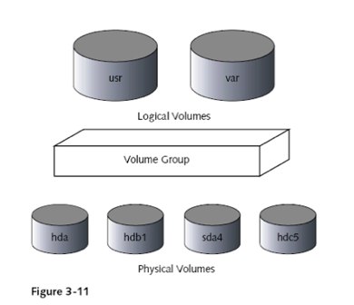

# Understanding System Initialization

## Hardware Initialization
- Basic Process
  - CPU begins to executing command in BIOS
  - BIOS passes control to boot Loader
  - Boot Loader passes control to Linux Kernel
- After computer start
  - CPU initialize itself
    - send signal to other parts of computer
  - BIOS : check every element in pc
    - check memory and other hardware by perform power-on
  - BIOS send signal to SCSI controller card to initialize itself
  - BIOS determines which device to search for OS

## Boot Loader
- AKA : Boot Manager
    - program loaded by BIOS
- at hdd 
- use for booting dirrent version or os
  - LILO(Linux loader)
  - GRUB --> Default on most systems
- uname command : Display information about Kernel
  - uname -a : Full version number of current kernel
  - uname -v : timestamp of kernel


## **Understanding RUN Level**
- Run Level 
  - Numbered mode of operation
  - Default is level 5
  - Defined in /etc/inittab file
- init or telinit command for CentOS 6 or below)
- systemctl command for CentOS 7 or later

## **Linux 7 Level (init)**
- 7 Level Contains called ***init***
  - 0 : HALT -->shutdown
  - 1 : Single Mode/ Rescue Mode : use for maintainance --> mostly use in repairing hdd, admin forgeting password --> Reset Password
  - 2 : No Net/ No GUI (Old : use 3 instead)
  - 3 : Network without GUI Mode 
  - 4 : No Use
  - 5 : Network with GUI Mode
  - 6 : Reboot Mode
  
- Power On --> 5 (default) or 3 --> use power off --> 0 (which program should be terminate)
- Each level contain sequence of program to start and terminate.
- called ***run level***

### RC Script
- All the script are located in /etc/init.d directory 
- manage directory is @ /etc/rc.d
  - contain **init.d(direatory) rc.local** ver.9
  - contain many rc#number e.g. rc3 : run in level 3 --> (Stop) K50networ, S10Network(Start) : when go to level 3 run S10Network file smallest number runs first.
### Manage Service
  - servive command
    - service named start
    - service named status
    - service lpd restart
  - chkconfig command
    - Alter files in run-level directories
    - modify services started or stopped each time system stared
    - default run level 2 through 5
    - e.g. : chkconfig named on

## **Systemd**
- Use OO (Object Oreinted)
- manages all units such as service, socket, mount and so on, stores all log data. 

### Systemd library & Linux Kernel
- systemd requires to enable 'cgroup' and 'autofs' option in Kernel configuration


- called ***target***


- change naming : e.g. level 5 --> multi-user
- target
  - sysinit.target
  - basic.target
  - bootmode.target
  - multi-user.target
  - graphical.target

### Systemctl
- To start or stop a service 
  - systemctl ***start*** blah.service
  - systemctl ***stop*** blah.service
- Restart(stop and start) and reload(reconfig)
  - systemctl ***restart*** blah.service
  - systemctl ***reload*** blah.service
- Enabling(start everytime when booted) or disabling units 
  - systemctl ***enable*** blah.service
  - systemctl ***disable*** blah.service
- systemctl list-units --all
- systemctl list-unit-files : to see all the units and if they are enabled or not

### Systemd Style
- systemctl : for controlling
- journalctl –k : use in logging , this command show only the kernel message

### Systemd Targets
- Setting a default target 
  - systemctl set-default graphical.target
- Getting the current default 
  - systemctl get-default
- And for compatibility, there are symlinks to
  - runlevel0.target -> poweroff.target
  - runlevel1.target -> rescue.target
  - runlevel2.target -> multi-user.target
  - runlevel3.target -> multi-user.target
  - runlevel4.target -> multi-user.target
  - runlevel5.target -> graphical.target
  - runlevel6.target -> reboot.target

## **Single User Mode**

-require password --> Edit

- replace ro with rw init=/sysroot/bin/bash
- boot without using disk and then using chroot to mount disk
- delete password for root
- Replace ro with rw init=/sysroot/bin/bash
- Press ctrl+x to boot
- Type “chroot /sysroot/
- vi /etc/shadow
- Alt+Ctrl+Del to restart

## Shutting Down

- Use reboot command
- Use halt command
- Use shutdown command
- Pressing Ctrl+Alt+Del (Restart)
- Entering the command init 0 
  - Halt system
- Entering command init 6
  - Restart system
  - 
## Systemctl
- Power off the system 
  - systemctl poweroff
- reboot the system
  - systemctl reboot
- boot into rescue mode
  - systemctl rescue

# Managing Software Packages and File Systems

## Mangaing Package
- rpm
  - install/delete new software package
  - options :
    - -qa option : query database and learn about packages
    - -i or -U option : install or upgrade package
    - -e option : erase (uninstall) rpm package
- Exercise
  - wget http://ftp.mcs.anl.gov/pub/mpi/mpich-1.2.7.tar.gz --no-check-certificate
  - tar xvfz mpich-3.3.1.tar.gz
  - cd mpich-3.3.1/
  - ./configure (--prefix = /opt/mpich) ให้ไปติดตั้งที่ไหน well known option
  - make
  - make install
  - cd /opt/
  - ls -la

- Using Links
- Use ls command to look at links
  - -i	include inode number in listing
  - -l	show symbolic link names and inode link count
  - -L	traverse (hide) symbolic links (follow symbolic link to original file)
```$ touch nurse1
$ ln nurse1 nurse2
$ ln -s nurse1 nurse3
$ ls -il nurse[1-3]
62 -rw-r--r--   2 hawkeye users  224 Jul 18 09:41   nurse1
62 -rw-r--r--   2 hawkeye users  224 Jul 18 09:41   nurse2
63 lrwxrwxrwx   1 hawkeye users    6 Jul 18 09:41   nurse3 -> nurse1
$ ls -ilL nurse3
62 -rw-r--r--   2 hawkeye users  224 Jul 18 09:41   nurse3

```
## Checking File System Status
- fsck utility
  - Example: fsck /dev/hda1

## Creating New File System
- Adding file system means 
  - Adding hard disk device to your system 
  - Making hard disk available to Linux by: 
    - Formatting
    - Mounting

## Mounting 
- mount command
  - To access file system
  - Indicate: 
    - Device on which file system is stored 
    - Directory where file system should be made accessible in directory structure
  - Example: mount -t ext3 /dev/sdb2 /archive
- lost+found directory
  - Placed in beginning of all new ext2 and ext3 file systems
  - Indicates successful mounting
  

# Window Only have  CIFS or SMB(Samba) Protocol
## Window Client using samba
# Samba
## ที่มา
- MS DOS : IMB CC DOS --> Mainframe  จึงสร้าง SMB
## Overview
- can be attacked by ransomware
- used the Server Message Block(SMB) protocol 
- is native to Windows, unlike NFS
- CIFS
## Servive
- Linux use IP to communicate
- Window use name to communicated(WINS:window protocol)
- allow browsing network.
## WorkGroup & Domain
- ทั้งสองอันไว้ใช้ grouping client
- Domain มีคุณสมบัติการทำ single signON --> เข้าเครื่อง a เข้าเครื่อง b ได้เลย หากอยู่ใน domain เดียวกัน
- WorkGroup is single authenticated

# Linux Administrator
## Basic BackUp Concept


- full backup : same size as original, take time
- ควรทำ วันศุกร์เที่ยงคืน เสร็จวันอาทิตย์ --> มีการใช้ disk น้อย
- mon : edit file A C --> เก็บ A' C' --> เก็บเฉพาะสิ่งเปลี่ยนแปลง Incremental BackUP
- Tue : A'' B' C''--> Incremental BackUp
- Wed, Thr, Fri --> Incremental BackUP
- Incremental BackUP ขึ้นกับ แต่ละบริษัท --> Bank every 2 hours.(12 Times a day)
## Restore
- ดึงมาจาก Full BackUp --> Incremental ทีละอัน: F-->I1-->I2-->I3 : **Slow**

## BackUP Continue
- Diffrence Backup : Check from full backup --> store A''
- D can make recovery faster.
- I6-I10 : เทียบกับ D

## Why BackUP?
- เผลอลบไฟล์
- hardisk เสีย
- อยากได้ version เก่า
- migration failure --> Upgrade or change system

## How to BackUP
- Past: Using Tape
- จารไม่ได้เน้น แค่ให้ดู

## Scheduling 
### at
- #at จะทำ 1 ครั้ง
- #at [-f file] TIME
- #at 12:50
- -->return prompt
- at>ls -l
- at>whoami
- ctrl+D
- mail

### crontab
- 5 Parameter --> Min Hr Day Month DayOfWeek
- 0 8 * * * ls -la --> all day all month at 8:00 done ls -la
- 30 2 * 1 0,6 --> ตี 2 30 นาที ทุกเสาร์ อาทิตย์ เดือนมกรา
- 30 2 3 1 0 --> ON sunday 3 January at 2:30 am
- 0 0,12 * * * --> Noon and Midnight 
- 0,10,20,30,40,50 * * * * -->every 10 min
- crontab -e --> go to vi editor
- crontab -l : list
- crontab is on user


## Security : Secure System

### Way of Security Attack
- Human
  - Peeping, Intrusion, Trash search, theft, human error
- System
  - Virus, malware, Trojan horse
  - Password cracking
  - Buffer overflow attacks
  - Denial-of-service (DoS)
  - Port scanning, Packet sniffing
- Physical
  - Damage, Disaster 

### How security is compromised?
- Social engineering
  - The users/admins are often the weakest links in the chain of security
  - 60% of security incidents involve an insider
  - Educate the users
- Human errors
  - Configuration errors
  - Accounts without passwd

### Security Tips
- Employ packet filtering
- Update software patches
  - Put “yum update” in the crontab
- Frequent backups
- Logging
  - /var/log/messages
  - /var/log/secure
  - /var/log/maillog
  - /var/log/wtmp
- Centralized remote logging    
  - $ man syslog.conf
- Turn off unnecessary services
```
$ /bin/netstat -ta | grep LISTEN
tcp        0      0 *:submission	*:*                     LISTEN
tcp        0      0 *:sunrpc		*:*                     LISTEN
tcp        0      0 *:x11		*:*                    	    LISTEN
tcp        0      0 *:38516		*:*                         LISTEN
tcp        0      0 localhost:ipp	*:*                     LISTEN
tcp        0      0 *:smtp		*:*                         LISTEN
…

```

```
$ /usr/sbin/lsof -i :38516 			(root privileges)
COMMAND   PID   USER   FD   TYPE DEVICE SIZE NODE NAME
rpc.statd 911 nobody    9u  IPv4   1952       TCP *:38516 (LISTEN)
```

- Passwords
  - To check for null passwords

```
$ perl -F: -ane ‘print if not $F[1];’ /etc/shadow
```
- Password aging with chage command
```
#chage -l <username>					(L --list)
#chage -M 90 <username>			        (Maxday)
#chage -E 2020-02-01 <username>         (Expire date)
#chage -W 10 <username>			        (warn date)
#chage -I 20 <username>				    (Inactive date)
```

- less
```
$ /usr/bin/less /var/log/maillog
```
- last
```
$ /usr/bin/last -f /var/log/wtmp -t 20080520144258
```


- lastlog
```
$ lastlog -u weesan
Username  Port      From       Latest
weesan      pts/14   xx.xx.xx  Tue May 27 22:39:35 -0700 2008 
```
- grep
```
$ /bin/grep "Relaying denied" /var/log/maillog
May 27 21:54:58 fw sm-mta[4463]: m4S4swAI004463: ruleset=check_rcpt,arg1=<ssmmttpp0509@yahoo.com.cn>, relay=219-84-62-105-adsl-tpe.dynamic.so-net.net.tw [219.84.62.105], reject=550 5.7.1 <ssmmttpp0509@yahoo.com.cn>... Relaying denied
```
- cat
```
/bin/cat /var/log/secure
May 27 21:14:05 fw vsftpd[4068]: refused connect from 66.11.116.140
May 27 22:24:15 fw vsftpd[4474]: refused connect from 204.8.216.130
May 27 23:10:02 fw in.rshd[4558]: connect from 10.0.0.33
May 27 23:11:36 fw su[4606]: + pts/4 weesan-root
```
- tail -f
```
$ /usr/bin/tail -f /var/log/messages
May 27 22:10:52 fw sshd[4118]: Accepted publickey for weesan from 10.0.0.33 port 41551 ssh2
May 27 21:58:12 fw -- MARK --
May 27 22:18:13 fw -- MARK --
May 27 22:38:13 fw -- MARK --
```

- nmap
  - Port scanning
```
$ nmap -sT www.linux.is.better
```
  - Guess what OS a remote system is running
```
$ nmap -O -sV www.linux.is.better
```
- Nessus
  - A powerful and useful software vulnerability scanner
  - 
- John the Ripper
  - Crack replacement

### TCP wrapper
- /etc/hosts.{allow,deny}
- $ cat /etc/hosts.deny
    - ALL:ALL
- $ cat /etc/hosts.allow
  - sshd: 10.0.0.0/255.255.0.0
  - Sendmail: ALL

- filter 6 services which are Telnet(telnetd), FTP(ftpd), Finger, Talk, rlogin, SSH(ssh) --> usually block remote login
- sshd:192. --> All IP 192.x.x.x 
- sshd:ALL --> All IP
- allow --> sshd:192.168.210. , deny --> sshd:ALL 
- Firewall (ปิดทุกอย่าง เปิดบางอย่าง)


## Nessus
### Installation
```
wget https://www.dropbox.com/s/9cz4s1k8dufpkj7/Nessus-10.0.0-es7.x86_64.rpm
rpm -ivh Nessus-10.4.0-es9.x86_64.rpm
```
- Go to https://localhost:8834
- Register
- Initializing
- Scanning
- Or You can customize your scan

## Grub2 Password
```
[root@localhost]# cd /etc/grub.d/
[root@linux grub.d]# ls
00_header  01_users  10_linux.bak  20_ppc_terminfo  40_custom  README
00_tuned   10_linux  20_linux_xen  30_os-prober     41_custom
[root@linux grub.d]# vi 10_linux
```


- Reboot
```
Enter username:
root
Enter password:
_
```

- In class Not Complete!!

## Tunung System 
- Protect GRUB
- turn offf unused service
- Disable Ctrl + Alt + Del (Reboot) --> systemctl mask ctrl-alt-del.target

## Tuning SSH Service
- Disable Root Login --> Edit /etc/ssh/sshd_config --> PermitLogin no 
- PRotocol version 3 --> Edit /etc/ssh/sshd_config --> Protocol 2
-  systemctl restart sshd

## Blocked ICMP
- Disable Ping
  - Edit /etc/sysctl.conf
  - #Ignore ICMP request:
  - net.ipv4.icmp_echo_ignore_all=1
  - #ignore Boardcast Request
  - net.ipv4.icmp_echo_ignore_boardcasts=1
  - sysctl -p --> presistent

- or

  - sysctl  net.ipv4.icmp_echo_ignore_all=1 -p(presistent)
  - sysctl  net.ipv4.icmp_echo_ignore_boardcasts=1 (if dont have -p option reboot will restore to default)


# Configure a File System with Logical Volume Management (LVM)

- Logical Volume Management
  - Provides a higher-level view of the disk storage
  - Gives you much more flexibility in allocating storage to applications and users
  - You can resize and move logical volumes
    - While partitions are still mounted and running
  - Use LVM to manage logical volumes with names that make sense



## LVM Features

- You can combine several hard disks or partitions
- You can enlarge a logical volume when free space is exhausted
- You can add hard disks to the volume group in a running system
- You can add logical volumes in a running system
- You can use several hard disks with improved performance in the RAID 0 (striping) mode
- You can add up to 256 logical volumes
- The Snapshot feature enables consistent backups

## LVM Excercise
- Create new 5GB of storage on VMware (Assume new disk is /dev/sdc)
```
fdisk /dev/sdc
```

```
pvcreate /dev/sdc1
pvscan
pvdisplay /dev/sdc1
```

```
vgcreate share  /dev/sdc1
vgscan
vgdisplay share
```
```
lvcreate --size 1G --name www  share
lvcreate --size 2G --name data share
lvscan
lvs
```
```
mkfs.ext4 /dev/share/www
mkfs.ext4 /dev/share/data
mkdir /www
mkdir /data
mount /dev/share/www /www
mount /dev/share/data /data
df -h
lvextend --size +500M --resize share/www
df -h 

```

# What is firewalld?

- Dynamic, modern control of system firewall functions  
- Still iptables underneath
- Major features :
  - Real time rule changes without interruption  
  - Zones to simplify and segregate configuration
  - Separate network traffic & rules by interface and zone 
  - GUI that works
  - System configs in /usr/lib/firewalld/*  
  - Custom configs in /etc/firewalld/*  
  - Daemon runs in user space
  - Protocol independent: IPv4 & IPv6

## Zones
- Manages groups of rules
- Dictate what traffic should be allowed
  - Based on level of trust in connected  network(s)  
  - Based on origin of packet
- Network interfaces are assigned a zone
```
$ firewall-­cmd --get-zones
```

### Default Pre-Defined Zones
- drop : Drop all incoming traffic unless related to outgoing traffic (do  not even respond with ICMP errors).
- block :
Reject all incoming traffic unless related to outgoing traffic.
- dmz :
Reject incoming traffic unless related to outgoing traffic or  matching the ssh pre-defined service.
- external :
Reject incoming traffic unless related to outgoing traffic or  matching the ssh pre-defined service. Outgoing IPv4 traffic  forwarded **through this zone is masqueraded** to look like it  originated from the IPv4 address of the outgoing network  interface.
- public :
Reject incoming traffic unless related to outgoing traffic  or matching the ssh, or dhcpv6-client pre-defined  services. The default zone for newly-added network  interfaces.
- work : 
Reject incoming traffic unless related to outgoing traffic  or matching the ssh, ipp-client, ordhcpv6-client pre-  defined services.
- internal : 
Reject incoming traffic unless related to outgoing traffic  or matching the ssh, mdns, ipp-client, samba-client, or  dhcpv6-client pre-defined services.
- home : 
Same as internal
- trusted : 
Allow all incoming traffic.

### Turning on firewalld
```
$ sudo systemctl start firewalld.service
```
We can verify that the service is running and reachable by typing:

```
$ firewall-cmd --state
```
Output:
running

This indicates that our firewall is up and running with the default configuration.


## Exploring Zones

- We can see which zone is currently selected as the default by typing:
```
$ firewall-cmd --get-default­-zone
```
output : 
```
public
```

- Since we haven't given firewalld any commands to deviate from the default zone, and none of our interfaces  are configured to bind to another zone, that zone will also be the only "active" zone (the zone that is  controlling the traffic for our interfaces). We can verify that by typing:
```
$ firewall-cmd --get-­active­-zones
```
output : 
```
public
    interfaces: eth0 eth1
```
- Here, we can see that we have two network interfaces being controlled by the firewall (eth0 and eth1). They  are both currently being managed according to the rules defined for the public zone.


## Examining Alternate Zones
We can see the specific configuration associated with a zone by including the --zone= parameter in our
 --list-all  command:

```
$ firewall-cmd --zone=home --­list­-all
```
output : 
```
home
    interfaces:  sources:
    services: dhcpv6­client ipp­client mdns samba­client ssh  ports:
    masquerade: no  forward­ports:  icmp­blocks:  rich rules:
```
- You can output all of the zone definitions by using the --list-all-zones option. You will probably want to pipe the output  into a pager for easier viewing:

```
$ firewall­-cmd --list-­all­-zones | less
```
## Changing Zones 

- You can transition an interface between zones during a session by  using the --zone= parameter in combination with the --change-  interface= parameter. As with all commands that modify the firewall,  you will need to use sudo.

- For instance, we can transition our eth0 interface to the "home"  zone by typing this:

```
$ sudo firewall-cmd --zone=home --change-­interface=eth0

```

output

```
success

```

## Checking Zones
```
$	firewall-cmd ­­--get-­active-­zones
```
output :
```
home
interfaces: eth0  public
interfaces: eth1
```
- If the firewall is completely restarted, the interface will revert to the default zone:
```
$ sudo systemctl restart firewalld.service
$ firewall-­cmd --get-­active-zones
```
output :
```
public
    interfaces: eth0 eth1
```

## Setting the Default Zone
- If all of your interfaces can best be handled by a single zone, it's  probably easier to just select the best default zone and then use that for  your configuration.

- You can change the default zone with the --set­-default-­zone=  parameter. This will immediately change any interface that had fallen  back on the default to the new zone:
```
$ sudo	firewall-­cmd	­­--set­-default­-zone=home
```
output
```
home
    interfaces:	eth0 eth1
```

## Making Permanment Zone Changes
- Modify zone for the connection in firewalld
```
	firewall-cmd --zone=home --change-interface=eth0 --permanent
```
**--permanent**

- Optional - restart the network and firewalld  service
```
systemctl restart network.service
```


## Firewall Service
- Services are sets of firewall rules to open ports associated with a particular  application or system service.

- The easiest method is to add the services or ports you need to the zones you are  using. Again, you can get a list of the available services with the --get-services option
```
    $ firewall-cmd --­­get-­services
```
output : 
```
RH­Satellite­6 amanda­client bacula bacula­client dhcp  dhcpv6 dhcpv6­client dns ftp high­availability http https  imaps ipp ipp­client ipsec kerberos kpasswd ldap ldaps  libvirt libvirt­tls mdns mountd ms­wbt mysql nfs ntp openvpn  pmcd pmproxy pmwebapi pmwebapis pop3s postgresql proxy­dhcp  radius rpc­bind samba samba­client smtp ssh telnet tftp  tftp­client transmission­client vnc­server wbem­https
```

## Firewall Service Definitions
- Each service is defined by it's associated .xml file within the
- /usr/lib/firewalld/services directory. For instance, the SSH service is defined like this:
- /usr/lib/firewalld/services/ssh.xml

```
<?xml version="1.0" encoding="utf­8"?>
<service>
    <short>SSH</short>
    <description>
        Secure Shell (SSH) is a protocol for logging into and  executing commands on remote machines. It provides secure encrypted  communications. If you plan on accessing your machine remotely via  SSH over a firewalled interface, enable this option. You need the  openssh­server package installed for this option to be  useful.
    </description>
    <port protocol="tcp" port="22"/>
</service>
```

### Activating Service (Permanently)
```
$ sudo firewall-cmd --zone=public (--permanent) --add-service=http
```
```
$ sudo firewall-cmd --zone=public --­permanent --list­-services
```

output :
```
dhcpv6­client http ssh
```

### Individual Firewall Rules
```
$ sudo firewall-cmd --zone=public --permanent --add-­port=5000/tcp
$ sudo firewall-cmd --zone=public --permanent --add­-port=4990-4999/udp
$ sudo firewall-cmd --zone=public --permanent --list­-ports
```


output
```
success
success
4990­4999/udp 5000/tcp
```

## Firewalld GUI
- The firewalld GUI is  invoked with : firewall-config


## Additional Firewall Funstions

- IP Masquerading
```
$ firewall-cmd --zone=public --query-masquerade
$ firewall-cmd --zone=public --add-masquerade
```

- After enabling masquerading, you can set up port forwarding
```
$ firewall-cmd --zone=public --add­forward­port=port=22:proto=tcp:toport=3753
```
Or address forwarding
```
$ firewall-cmd --zone=external --add-­forward-port=port=22:proto=tcp:toaddr=192.0.2.55
Or both port & address forwarding:

$ firewall--­cmd --zone=external / --add-forward-port=port=22:proto=tcp:toport=2055:toaddr=192.0.2.55
```